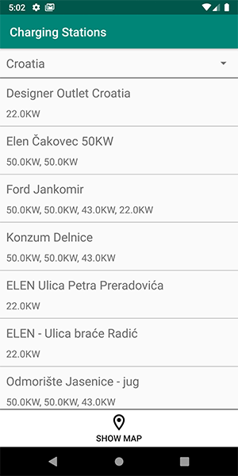
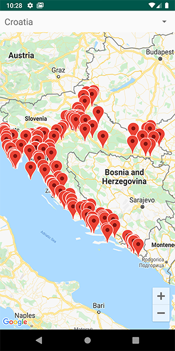

# Charging Stations  

>Sveučilište u Zadru - Odjel za informacijske znanosti 
>Kolegij: Razvoj mobilnih aplikacija 
>Nastavnik: dr. sc. Tomislav Jakopec 
>Autor: Kristijan Kačan 
### Powered by Open Charge Map API 
---
Android aplikacija koja prikazuje stanice za punjenje električnih automobila po državama. 
Korišten je Open Charge Map API za dohvaćanje podataka u JSON formatu. 
Za prikaz stanica na mapi korišten je Maps SDK for Android. 
Aplikacija je namijenjena svim vlasnicima električnih automobila da što lakše pronađu najbližu stanicu za punjenje svog limenog ljubimca.

### JavaDoc
Java API dokumentaciju možete pregledati na ovom [linku.][ln1]

### Screenshots
&nbsp;&nbsp;&nbsp;&nbsp;

[ln1]: <https://kkacan.github.io/ChargingStations/>
